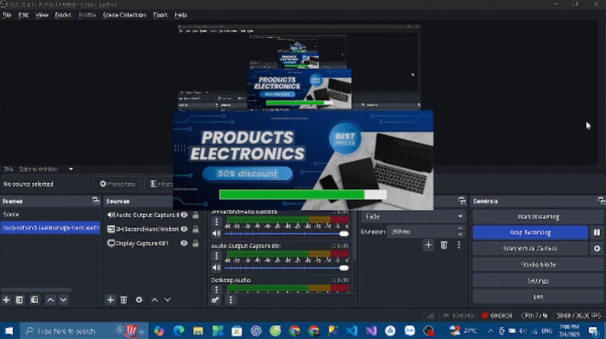

# ⚡ Sales Management System Software
## Framework: .NET 8, WinForms, ASP.NET (Entity Framework Core)
## Model: 3-Layer-Architecture

> 🚀 **Transforming retail management for the digital era!**
> Say goodbye to manual tracking and hello to a seamless, modern inventory and sales system tailored for electronic stores. Built on robust technologies like .NET 8, WinForms, and Entity Framework Core — this project sets the standard for desktop retail management solutions, engineered for future expansion into a powerful Client-Server model.

---

## 📖 Project Overview
This is a comprehensive sales management system, specifically designed for electronic stores. The project is built upon a solid 3-Layer Architecture, utilizing .NET 8 and Entity Framework Core 8, ensuring scalability, easy maintenance, and high performance. The system aims to provide a robust and efficient retail management solution, ready for future deployment as a Client-Server model.

---

## 📸 Visualization

See the application in action with these animated demonstrations:

  <h3>Sales Workflow: From Search to Invoice</h3>
  
   
  <em>A seamless sales process: **Search** products by name  &rarr; **Select Products** and add to orderdetails list &rarr; Click **Order** to continue &rarr; **Confirm Form** invoice printing options, and add/edit customer information &rarr; **Confirm** to Success Order &rarr; (Optional) **Invoice**.</em>

  <h3>Main Interface</h3>
  
   
  <em>The main application interface – where all functionalities are intuitively connected.</em>

  <h3>Authentication & Security</h3>
  
  
   
  <em>Secure user login and password management.</em>

💬 Feedback, suggestions or collaboration ideas are warmly welcome!