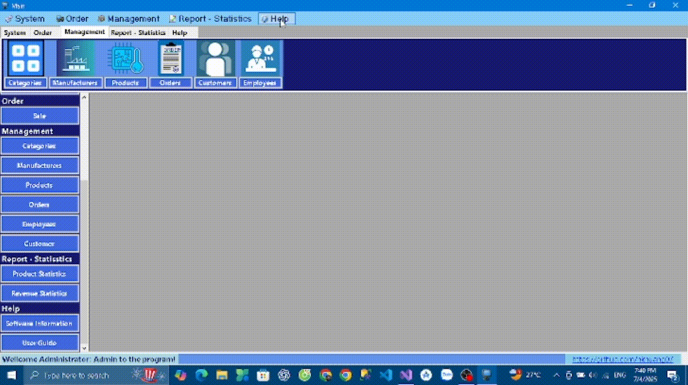

# Sales Management System Software - ASP.NET (Entity Framework Core) in 3-Layer Architecture
---
## 🎯 Project Overview: Revolutionizing Electronic Store Management

In an era defined by rapid technological advancements, manual store management practices often lead to inefficiencies, data discrepancies, and lost opportunities. This project directly addresses these challenges by delivering an innovative **Electronic Store Management Software**. Our solution is designed to automate and optimize every facet of retail operations, particularly for businesses dealing with electronic goods like smartphones, laptops, and various components.

The core motivation behind this software is to empower store owners and employees with an intuitive, robust, and high-performance management application built on **Windows Forms**. By leveraging cutting-edge **.NET 8.0 technologies** and a meticulously designed **3-Layer Architecture** powered by **Entity Framework Core 8**, we provide essential functionalities that enable swift, accurate task execution, thereby dramatically boosting overall business efficiency and strategic decision-making. This project is engineered for today's needs and future scalability, ready to seamlessly transition to a sophisticated Client-Server model.

Explore the application's vibrant interface and powerful functionalities through these visual demonstrations:
---
* **Video Demonstration: Comprehensive Application Walkthrough**


### Authentication

Secure login and password management for users.


### Order Processing

Handle customer orders and view details seamlessly.


### Data Management

Manage your products, categories, and manufacturers efficiently.

**Products**


**Categories**


**Manufacturers**


### User Management

Manage your employees and customer database.

**Employees**


**Customers**


### Reporting & Statistics

Gain insights with detailed product and revenue statistics.

**Product Statistics**


**Revenue Statistics**


### Help & About

Access software information and help resources.




---
## ✨ Key Features

Our Electronic Store Management Software offers a rich set of features designed to streamline daily operations:

* **Product Management** 📦: Full CRUD (Create, Read, Update, Delete) operations for products, including detailed information such as product code, name, description, price, stock quantity, images, and category assignments. [cite: 1223]
* **Category Management** 🏷️: Efficiently classify products into specific categories for better organization and searchability. [cite: 1224]
* **Manufacturer Management** 🏢: Manage information about product manufacturers. [cite: 1304]
* **Employee Management** 🧑‍💼: Store and manage employee information. (Admin-only access) [cite: 1225, 1306]
* **Customer Management** 👤: Maintain customer records for invoicing and purchase history tracking. [cite: 1226]
* **Order & Order Details Management** 📝: Support for creating sales invoices, calculating totals, tracking order status, and managing sold products. [cite: 1227]
* **Reporting & Statistics** 📊: Generate comprehensive sales and product reports, with print capabilities via ReportViewer. [cite: 1228, 1239]
* **SQL Server Data Storage** 💾: All data is securely stored and processed using Microsoft SQL Server, ensuring data integrity and security. [cite: 1229]
* **3-Layer Architecture** 🏛️: The software is built upon a robust three-layer architecture (Presentation, Business Logic, and Data Access Layers) with Data Transfer Objects (DTO) for efficient data flow. [cite: 1230, 1300, 1301, 1302, 1303, 1304, 1305, 1306, 1307, 1308, 1309]
---

## 🛠️ Technical Stack & Architecture: Powering Robust and Scalable Solutions

This project is meticulously crafted using cutting-edge Microsoft technologies, ensuring a foundation built for high performance, exceptional maintainability, and seamless extensibility. Our architectural choices are designed to deliver a modern, resilient, and future-proof application.

### Core Technologies Driving Innovation

* **Visual Studio 2022**: The premier Integrated Development Environment (IDE) that serves as our central hub for comprehensive project development, efficient code management, and streamlined debugging.
* **SQL Server 2022**: As the robust relational database management system (RDBMS), SQL Server 2022 provides a secure, highly efficient, and scalable backbone for all critical data storage, retrieval, and complex transactional processing needs.
* **Entity Framework Core 8**: This state-of-the-art Object-Relational Mapper (ORM) is pivotal for enabling a powerful, object-oriented approach to database interactions. It allows developers to seamlessly manage database entities as intuitive C# objects and leverage the full power of LINQ for data querying, abstracting away complex SQL queries.
* **.NET 8.0 WinForms**: Our strategic choice for building the rich, user-friendly graphical interface of the Windows Forms application. .NET 8.0 brings significant performance enhancements and modern features, providing a responsive and intuitive user experience.
* **ReportViewerCore.WinForms**: An essential component for generating and displaying dynamic reports, such as detailed invoices and insightful sales summaries, directly within the application.
* **ClosedXML**: An invaluable open-source library empowering the application with robust Excel file (XLSX) manipulation capabilities, facilitating effortless export of comprehensive reports and critical business data.
* **Microsoft.Extensions.DependencyInjection.Abstractions**: This core library is fundamental to our architecture, enabling robust Dependency Injection (DI). DI significantly enhances modularity, testability, and promotes highly reusable code, adhering to modern software design principles.
* **SlugGenerator**: A practical utility library that intelligently converts product and category names into SEO-friendly "slugs," optimizing data presentation and searchability.

### The Strategic Edge: .NET 8.0 WinForms (over .NET Framework)

The deliberate decision to build on WinForms with **.NET 8 (part of the .NET Core branch)**, rather than the legacy .NET Framework, underpins our commitment to modern, high-performing, and forward-compatible software. This strategic choice offers an array of compelling advantages:

* **Unparalleled Performance & Optimization**: .NET 8 features a re-architected runtime delivering significantly faster startup times, reduced memory footprints, and superior execution speeds. This is crucial for data-intensive applications, ensuring a snappy and efficient user experience.
* **Optimized Entity Framework Core Support**: EF Core is designed and continually optimized specifically for the .NET Core ecosystem. It offers advanced LINQ capabilities, robust asynchronous operations, sophisticated change tracking, and support for the latest database features. In contrast, .NET Framework is limited to EF6, which is no longer under active development, locking it out of future innovations.
* **Lightweight & Flexible Deployment**: .NET 8 allows for advanced deployment options, including runtime trimming and single-file executables. This results in significantly smaller application sizes, easier deployment, and fewer external dependencies, simplifying distribution and management.
* **Native Dependency Injection**: With built-in Dependency Injection support, .NET 8 inherently fosters a more robust and maintainable 3-Layer Architecture. This facilitates easier unit testing, promotes loose coupling between components, and strongly encourages adherence to SOLID principles, leading to higher quality code.
* **Future-Proof Development**: Microsoft's unwavering focus is exclusively on the newer .NET versions (starting from .NET 5). By choosing .NET 8, our project is positioned to leverage the latest features, tools, and libraries, ensuring long-term viability, continued support, and access to future advancements.
* **Seamless Extensibility**: The .NET 8 foundation provides an excellent springboard for future expansion, including seamless integration with Web APIs, development of Blazor applications, or even migration to cross-platform or cloud-native environments, future-proofing the application's growth potential.

### Entity Framework Core & SQL Server: The Data Power Duo

Our data management strategy is centered around the powerful combination of **Entity Framework Core** and **Microsoft SQL Server**, ensuring efficient, reliable, and secure data handling within our 3-Layer Architecture.

* **Entity Framework Core (EF Core)**: As a modern Object-Relational Mapper, EF Core meticulously abstracts all direct database interactions, allowing our development team to manipulate database entities intuitively as C# objects. This significantly boosts developer productivity, reduces the likelihood of SQL syntax errors, and simplifies data access. Key benefits include:
    * **Clear Layer Separation**: EF Core operates exclusively within the Data Access Layer (DAL), providing a clean separation of concerns and integrating flawlessly with our repository pattern.
    * **Code-First Development**: This approach simplifies database schema management, enabling developers to define the database structure directly from C# code. Powerful migration features facilitate effortless updates to the database schema as the application evolves.
    * **Robust LINQ Support**: EF Core's comprehensive LINQ integration empowers developers to write powerful, type-safe data queries directly in C#, enhancing readability, reducing errors, and accelerating development.
    * **Optimized for Scalability**: EF Core's design, including its efficient change tracking and ability to work seamlessly with Data Transfer Objects (DTOs), makes it highly adaptable for scalable solutions.

* **Microsoft SQL Server**: Serving as the secure and high-performance backbone, Microsoft SQL Server efficiently handles all data storage for this project. Its robust capabilities ensure data integrity, facilitate efficient management of large data volumes, and integrate seamlessly with Entity Framework Core for streamlined, object-oriented data manipulation. This combination provides a solid, enterprise-grade data platform.

### The Power of Layering: Our Enhanced 3-Layer Architecture with DTOs

Our software strictly adheres to a **Three-Layer Architecture** (often referred to as N-tier architecture), a robust design pattern fundamental to achieving high maintainability, exceptional scalability, and rigorous testability. This architecture is further enhanced by the strategic use of **Data Transfer Objects (DTOs)**, particularly crucial for our project's current state and its future expansion into a Client-Server model.

* **Presentation Layer (UI)**: This is the outermost layer, comprising the WinForms forms and controls, serving as the user's primary interface with the system. It is responsible solely for displaying data received from the Business Logic Layer (via DTOs) and capturing user inputs and actions, which are then passed to the Business Logic Layer. **Crucially, this layer has no direct knowledge of database operations.**
* **Business Logic Layer (BLL)**: The core intelligence of the application resides here. This layer encapsulates all critical business rules, performs data validation, orchestrates complex operations by interacting with repositories in the Data Access Layer, and handles the transformation of data between domain entities and Data Transfer Objects (DTOs).
* **Data Access Layer (DAL)**: This innermost layer is dedicated to direct interaction with the database using **Entity Framework Core**. It contains the repository implementations and mapping configurations, ensuring efficient and secure data persistence and retrieval. Each entity class in this layer typically maps directly to a database table.
* **Data Transfer Objects (DTOs)**: While not a separate *physical layer* in the traditional sense, DTOs form a vital *conceptual layer* or pattern that dictates how data is exchanged between the Presentation Layer and the Business Logic Layer. They are simple objects that carry data across process boundaries or between layers.
    * **Purpose**: DTOs are specifically designed to expose only the necessary data required by the consuming layer (e.g., the UI). This prevents over-fetching data, reduces network payload size, and enhances security by limiting exposure of sensitive internal entity structures.
    * **Efficiency**: They aggregate data from multiple entities into a single, optimized object for transfer, minimizing the number of calls between layers.

### Unlocking Scalability: Benefits for Client-Server Expansion

The meticulous design of our 3-Layer Architecture, especially with the disciplined use of DTOs, provides inherent and powerful advantages when extending the application to a **Client-Server model**:

* **Decoupling and Independence**: Each layer is loosely coupled, meaning changes in one layer have minimal impact on others. This separation allows the Business Logic Layer and Data Access Layer to reside entirely on a remote server, independent of the client application.
* **Streamlined Network Communication via DTOs**: DTOs become the well-defined "data contracts" for network communication. They are lightweight, serializable objects that represent exactly what data needs to be sent or received over the network (e.g., JSON or XML). This avoids sending bulky, complex domain entities directly over the wire, optimizing network performance and reducing security risks.
* **Enhanced Scalability**: By separating the UI from the BLL and DAL, the server-side components can be scaled independently to handle increased loads from multiple concurrent clients. This allows for horizontal scaling by deploying the server logic on more powerful or distributed machines.
* **Improved Security**: DTOs allow for precise control over what data is exposed to the client. Sensitive fields (like passwords or internal database IDs) can be omitted from DTOs sent to the client, significantly reducing the attack surface and enhancing data security.
* **Simplified Maintenance and Updates**: Server-side business logic and database interactions can be updated and deployed independently without requiring updates to every client application, simplifying maintenance and rolling out new features.
* **Cross-Platform Potential**: The clear separation of concerns, especially with a well-defined API via DTOs, lays a strong foundation for developing new clients on different platforms (e.g., web applications, mobile apps) that can consume the same server-side logic without modification.

---

## 🖼️ Application Visualization: A Glimpse into the User Experience

Explore key facets of the Electronic Store Management Software through these illustrative screenshots, providing a concrete view of its intuitive design and robust functionalities.

### Authentication & Access Control

Secure user login and comprehensive password management features.
<p align="center">
  <h3>Secure Login Interface</h3>
  
  <br>
  <h3>Password Change Interface</h3>
  
  <em>Seamless and secure login with robust password management capabilities.</em>
</p>

### Order Processing & Management

Efficiently handle customer orders and view detailed transaction information.
<p align="center">
  <h3>Orders Overview</h3>
  
  <br>
  <h3>Order Details View</h3>
  
  <br>
  <h3>Print Order Preview</h3>
  
  <em>Streamlined workflows for processing, viewing, and printing customer orders.</em>
</p>

### Master Data Management

Comprehensive tools to efficiently manage products, categories, and manufacturers.

#### Products
<p align="center">
  <h3>Products Management Interface</h3>
  
  <em>Effortlessly manage product inventory, details, and attributes.</em>
</p>

#### Categories
<p align="center">
  <h3>Categories Management Interface</h3>
  
  <em>Organize products logically with intuitive category management.</em>
</p>

#### Manufacturers
<p align="center">
  <h3>Manufacturers Management Interface</h3>
  
  <em>Maintain and update information for all product manufacturers.</em>
</p>

### User & Employee Management

Robust modules for managing both internal employees and customer databases.

#### Employees
<p align="center">
  <h3>Employees Management Interface</h3>
  
  <em>Administer employee records, roles, and access permissions.</em>
</p>

#### Customers
<p align="center">
  <h3>Customers Management Interface</h3>
  
  <em>Manage your customer database with ease, from contact details to purchase history.</em>
</p>

### Reporting & Statistics

Gain actionable insights with detailed product and revenue statistics.

#### Product Statistics
<p align="center">
  <h3>Product Statistics Dashboard</h3>
  
  <em>Analyze product performance, sales trends, and inventory levels.</em>
</p>

#### Revenue Statistics
<p align="center">
  <h3>Revenue Statistics Dashboard</h3>
  
  <em>Track financial performance with comprehensive revenue reports and visualizations.</em>
</p>

### Help & About Resources

Access essential software information and comprehensive help documentation.

#### Help Center
<p align="center">
  <h3>Integrated Help Center Website</h3>
  
  <em>Quick access to a comprehensive help guide for navigating the application.</em>
</p>

#### Application Splash Screen
<p align="center">
  <h3>Application Splash Screen</h3>
  
  <em>The initial screen displayed upon application startup, providing a smooth user experience.</em>
</p>

#### Software Information
<p align="center">
  <h3>Software Information Window</h3>
  
  <em>View detailed information about the software version, licensing, and credits.</em>
</p>

### Sales Operations

Streamlined and efficient processes for managing sales transactions.
<p align="center">
  <h3>Sales Processing Interface - Step 1</h3>
  
  <br>
  <h3>Sales Processing Interface - Step 2</h3>
  
  <br>
  <h3>Sales Confirmation Dialog</h3>
  
  <em>Intuitive multi-step sales processing, from item selection to final confirmation.</em>
</p>

### Main Application Interface

The central hub of the application, offering intuitive navigation and access to all modules.
<p align="center">
  <h3>Main Window Overview</h3>
  
  <em>The primary interface, providing easy access to all features through a well-organized toolbar and panels.</em>
</p>

## ⚙️ Setup and Deployment
Follow these steps to clone and run the project locally.

### 1. Clone the Repository

```bash
git clone [https://github.com/hkhuang07/Sales-Management-Application-ASP.NET-EF-Core-In-3-Layer-Architecture.git](https://github.com/hkhuang07/Sales-Management-Application-ASP.NET-EF-Core-In-3-Layer-Architecture.git)
cd Sales-Management-Application-ASP.NET-EF-Core-In-3-Layer-Architecture
```
### 2. Restore NuGet Packages
Open the project in Visual Studio 2022 and restore NuGet packages via the Solution Explorer or run:
```
MSBuild /t:restore
```
### 3. Database Initialization (Entity Framework Core Migrations)
This project uses Entity Framework Core's Code First approach to manage the database.

Option A: Create Database from Migrations

If you don't have the database set up, you can create it using EF Core migrations:
```
Add-Migration InitialCreate -OutputDir Migrations
Update-Database
```
Note: Ensure you have the dotnet-ef tool installed globally: dotnet tool install --global dotnet-ef

Option B: Restore Database

If you have a .bak file or prefer to restore from a backup, you would typically use SQL Server Management Studio (SSMS) to restore the database. The MSBuild /t:restore command mentioned in your prompt is for restoring NuGet packages, not SQL Server databases.
### 4. Configure Database Connection
The database connection string is typically configured in appsettings.json or App.config within the UI or DAL project. Ensure it points to your SQL Server instance.

Example (check OnConfiguring method in ElectronicsStoreContext.cs for exact connection string if it's hardcoded):
```
"ConnectionStrings": {
  "DefaultConnection": "Data Source=.;Database=ElectronsStore;Integrated Security=True;MultipleActiveResultSets=True;TrustServerCertificate=True"
}
```
### 5. Run the Application
Open the solution (.sln file) in Visual Studio 2022 and run the project.

## Author

* **Name**: Huynh Quoc Huy
* **GitHub Profile**: [hkhuang07](https://github.com/hkhuang07/)
* **Repository**: [Sales-Management-Application-ASP.NET-EF-Core-In-3-Layer-Architecture](https://github.com/hkhuang07/Sales-Management-Application-ASP.NET-EF-Core-In-3-Layer-Architecture)
