# Sales Management System Software - ASP.NET (Entity Framwork Core) In 3 Layer Architecture

## 🎯 Project Overview
This project is an **Electronic Store Management Software** developed to automate and optimize the management processes for retail stores, especially those dealing with electronic goods like phones, laptops, and various components. In today's rapidly evolving IT landscape, manual management methods (like notebooks or basic Excel sheets) are prone to data loss, inconsistencies, and inefficiencies. This software addresses these challenges by providing a comprehensive, user-friendly, and robust solution. [cite: 1210, 1211, 1212, 1213, 1214, 1215, 1216]

The primary goal is to deliver an intuitive management application for Windows Forms, equipped with essential functionalities to empower employees and store owners to perform tasks quickly and accurately, thereby enhancing overall business efficiency. [cite: 1218, 1219, 1221]

## 🚀 Visualized

Explore the application's interface and functionalities through these visual demonstrations:


### Authentication

Secure login and password management for users.


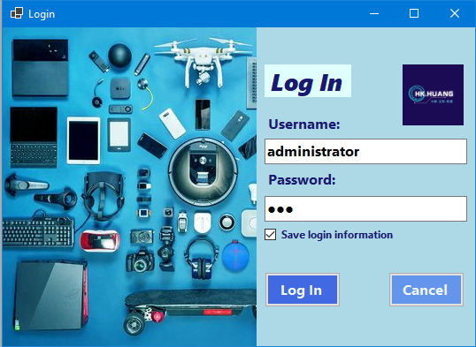
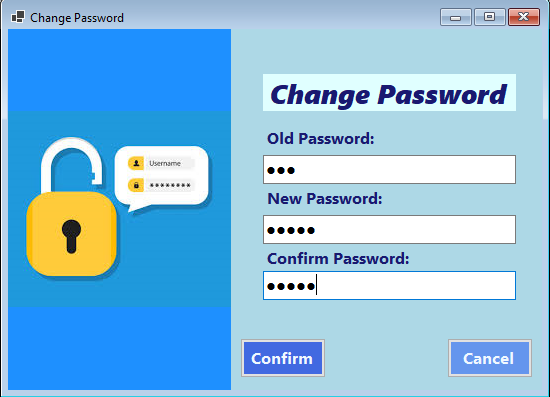

### Order Processing

Handle customer orders and view details seamlessly.


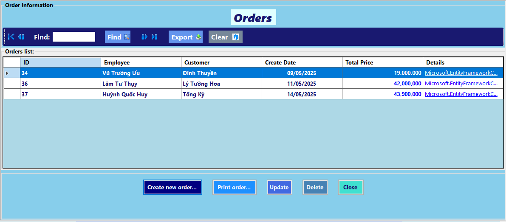
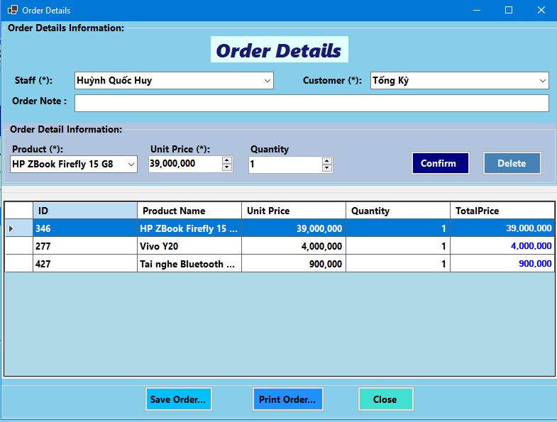
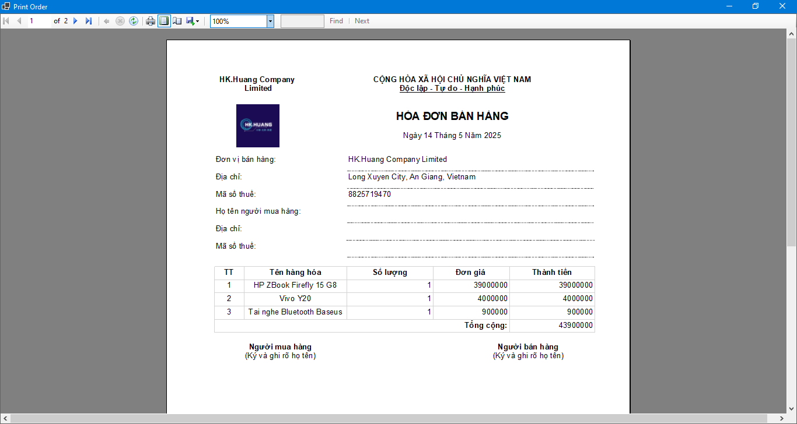

### Data Management

Manage your products, categories, and manufacturers efficiently.

**Products**


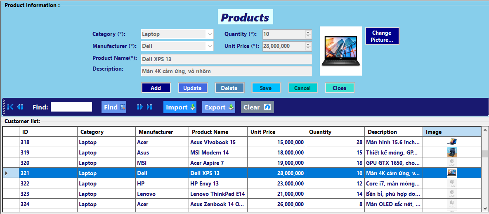

**Categories**


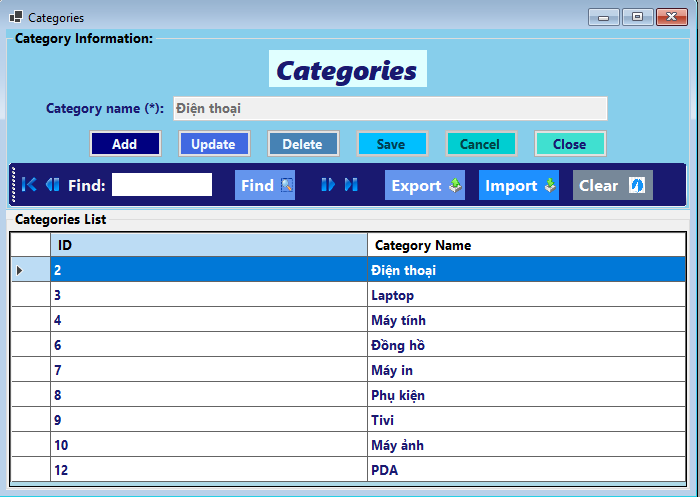

**Manufacturers**
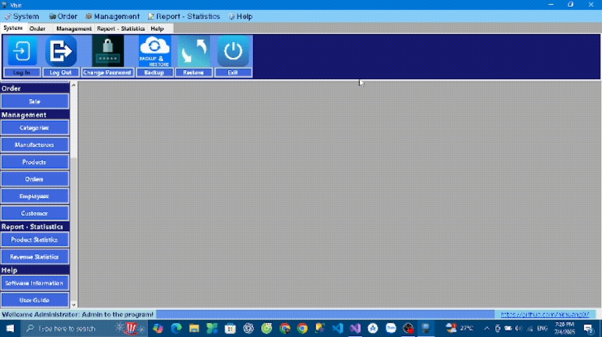

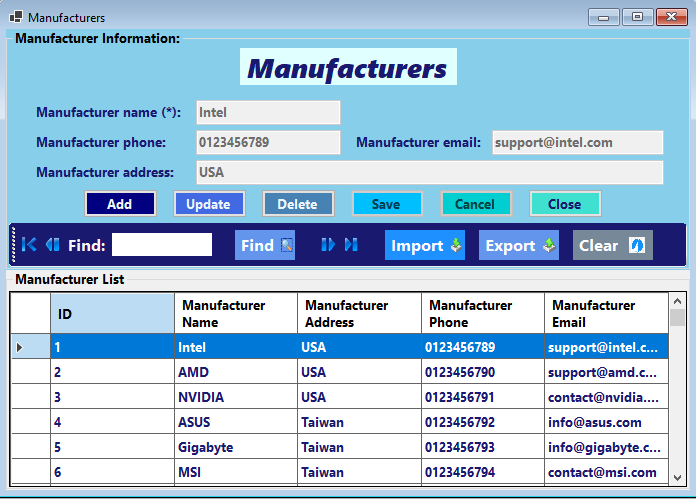

### User Management

Manage your employees and customer database.

**Employees**
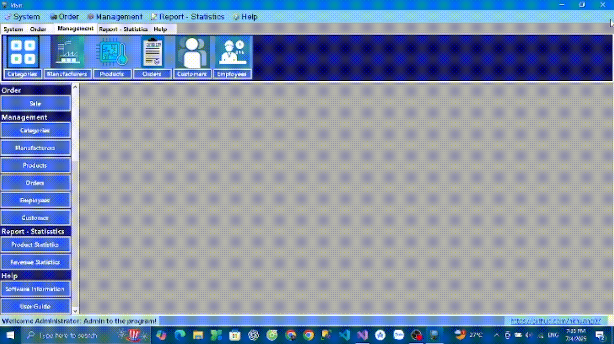

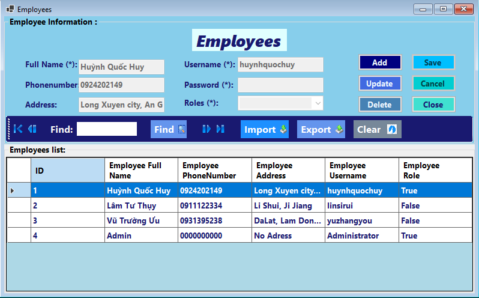

**Customers**


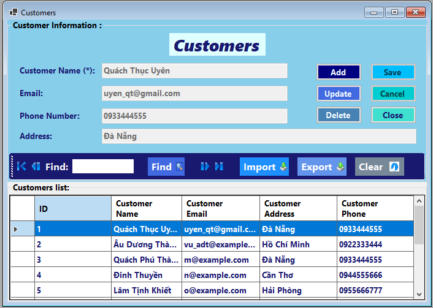

### Reporting & Statistics

Gain insights with detailed product and revenue statistics.

**Product Statistics**


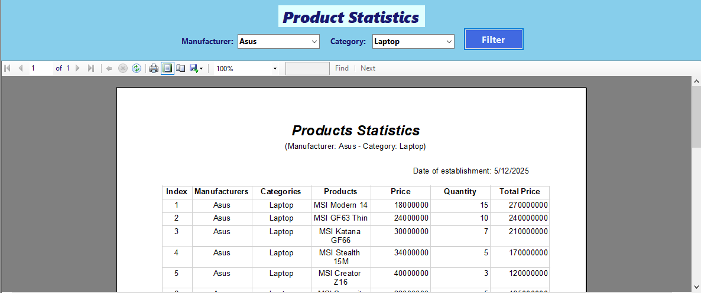

**Revenue Statistics**
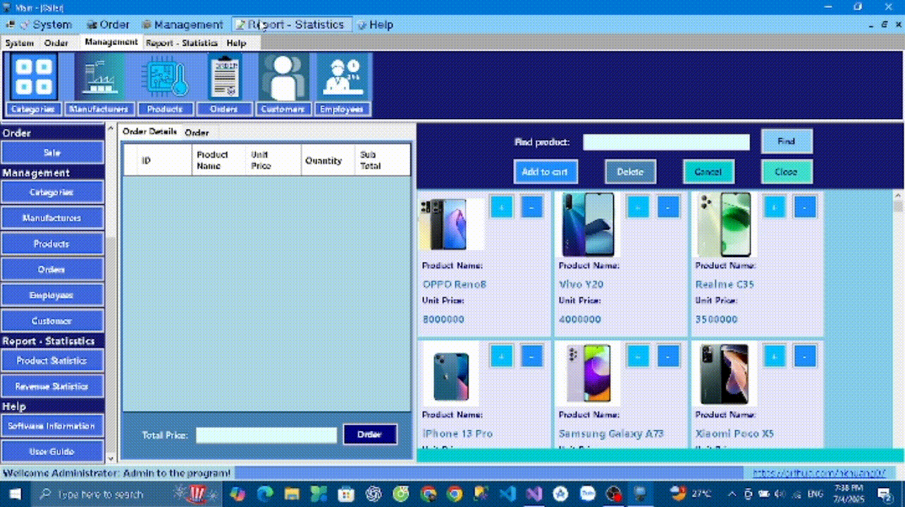

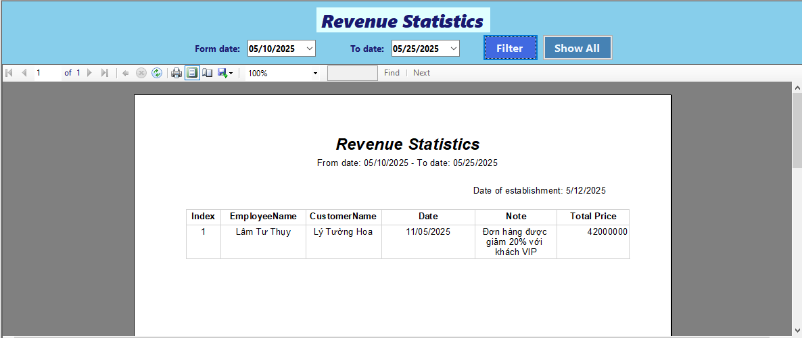

### Help & About

Access software information and help resources.


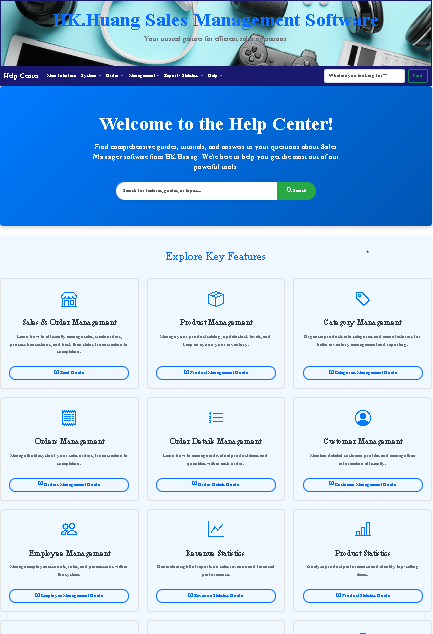
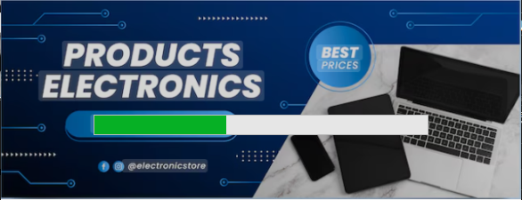
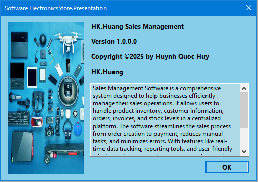

### Sales

Streamlined sales operations.

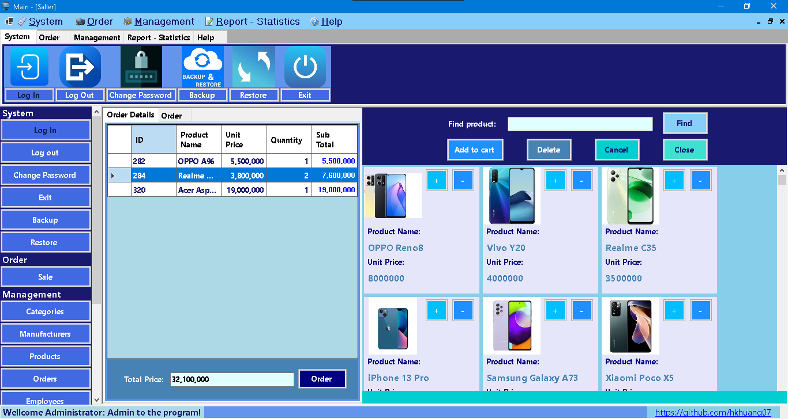
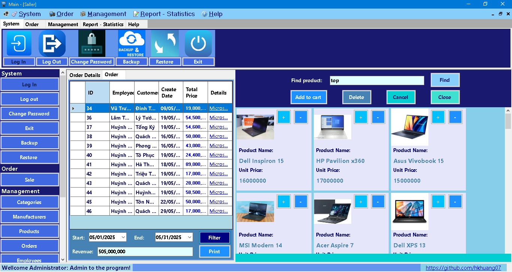
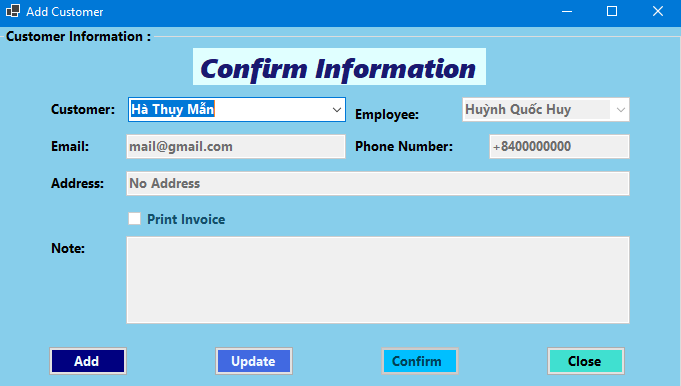

### Main Interface & Toolbars

The main application window provides intuitive navigation through various toolbars and panels.

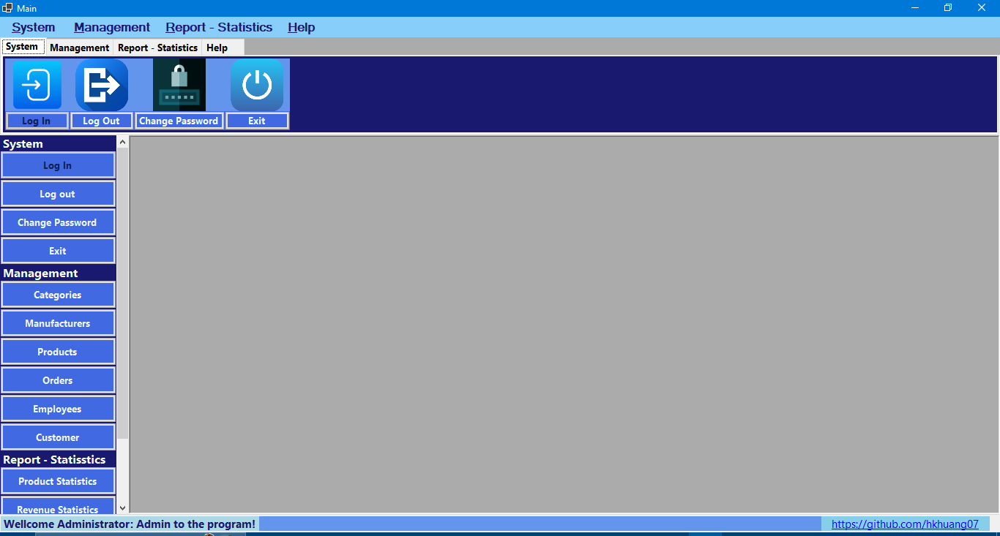

## ✨ Key Features

Our Electronic Store Management Software offers a rich set of features designed to streamline daily operations:

* **Product Management** 📦: Full CRUD (Create, Read, Update, Delete) operations for products, including detailed information such as product code, name, description, price, stock quantity, images, and category assignments. [cite: 1223]
* **Category Management** 🏷️: Efficiently classify products into specific categories for better organization and searchability. [cite: 1224]
* **Manufacturer Management** 🏢: Manage information about product manufacturers. [cite: 1304]
* **Employee Management** 🧑‍💼: Store and manage employee information. (Admin-only access) [cite: 1225, 1306]
* **Customer Management** 👤: Maintain customer records for invoicing and purchase history tracking. [cite: 1226]
* **Order & Order Details Management** 📝: Support for creating sales invoices, calculating totals, tracking order status, and managing sold products. [cite: 1227]
* **Reporting & Statistics** 📊: Generate comprehensive sales and product reports, with print capabilities via ReportViewer. [cite: 1228, 1239]
* **SQL Server Data Storage** 💾: All data is securely stored and processed using Microsoft SQL Server, ensuring data integrity and security. [cite: 1229]
* **3-Layer Architecture** 🏛️: The software is built upon a robust three-layer architecture (Presentation, Business Logic, and Data Access Layers) with Data Transfer Objects (DTO) for efficient data flow. [cite: 1230, 1300, 1301, 1302, 1303, 1304, 1305, 1306, 1307, 1308, 1309]

## 🛠️ Technical Stack & Architecture

This project leverages modern Microsoft technologies to ensure high performance, maintainability, and extensibility.

### Core Technologies Used

* **Visual Studio 2022**: Primary Integrated Development Environment (IDE) for project development and management. [cite: 1235]
* **.NET 8.0 WinForms**: The chosen framework for building the Windows Forms application, providing a user-friendly graphical interface. [cite: 1236]
* **SQL Server 2022**: The relational database management system (RDBMS) for efficient data storage, retrieval, and processing. [cite: 1237]
* **Entity Framework Core 8**: An Object-Relational Mapper (ORM) for seamless interaction with the database using C# objects and LINQ. [cite: 1238]
* **ReportViewerCore.WinForms**: For displaying and generating reports like invoices and sales summaries. [cite: 1239]
* **ClosedXML**: An open-source library for working with Excel files (XLSX), enabling easy export of reports and data. [cite: 1240]
* **Microsoft.Extensions.DependencyInjection.Abstractions**: Facilitates Dependency Injection (DI) for improved modularity, testability, and code reusability. [cite: 1241]
* **SlugGenerator**: A utility library for converting product/category names into SEO-friendly "slugs". [cite: 1242]

### Why .NET 8.0 WinForms (instead of .NET Framework)?

The strategic choice of WinForms on .NET 8 (part of the .NET Core branch) over the traditional .NET Framework was made for several compelling reasons: [cite: 1251, 1261]

* **Higher Performance & Optimization**: .NET 8 boasts a re-architected runtime with faster startup times and better memory management, ideal for data-intensive applications. [cite: 1253]
* **Superior Entity Framework Core Support**: EF Core is optimized for .NET Core, offering powerful LINQ capabilities, async operations, and advanced change tracking. .NET Framework is limited to EF6, which is no longer actively developed. [cite: 1254, 1255]
* **Lightweight & Flexible Structure**: .NET Core allows for runtime trimming and single-file deployment, resulting in lighter, easier-to-deploy applications with fewer dependencies. [cite: 1256]
* **Built-in Dependency Injection**: Native DI support in .NET Core enables a more robust 3-Layer Architecture, facilitating easier testing, decoupling, and adherence to SOLID principles. [cite: 1257]
* **Long-Term Development Future**: Microsoft's focus is entirely on the newer .NET versions (starting from .NET 5). Choosing .NET 8 ensures access to the latest features, tools, and libraries, future-proofing the software. [cite: 1258, 1259]
* **Future Extensibility**: Provides a better foundation for potential integration with Web APIs, Blazor, or migration to web/cross-platform environments. [cite: 1260]

### Entity Framework Core & SQL Server

**Entity Framework Core (EF Core)** is a modern ORM that abstracts database interactions, allowing developers to work with database entities as C# objects. It's a key component in our 3-Layer Architecture due to: [cite: 1263, 1264, 1265, 1272]

* **Clear Layer Separation**: EF Core operates directly within the Data Access Layer (DAL), integrating seamlessly with repositories. [cite: 1274]
* **Code-First Development**: Simplifies database schema management through migrations, enabling easy updates to the database structure from code. [cite: 1275, 1279]
* **Strong LINQ Support**: Enables powerful, type-safe data querying directly in C#, reducing SQL syntax errors and boosting productivity. [cite: 1277]
* **Scalability**: Facilitates easy integration with DTOs and tools like AutoMapper for data transfer between layers. [cite: 1278]

**Microsoft SQL Server** serves as the robust and secure backbone for all data storage in this project. It ensures data integrity, handles large volumes of data efficiently, and integrates seamlessly with Entity Framework Core for object-oriented data manipulation. [cite: 1283, 1284, 1285, 1286, 1289, 1290, 1291, 1292, 1293, 1294]

### 3-Layer Architecture

The software adheres to a **Three-Layer Architecture** (or N-tier architecture) to promote maintainability, scalability, and testability. [cite: 1230, 1252, 1300, 1301, 1302, 1303, 1304, 1305, 1306, 1307, 1308, 1309]

* **Presentation Layer (UI)**: The user interface layer (WinForms forms and controls) where users interact with the system. It displays data received from the Business Logic Layer (via DTOs) and sends user actions to the Business Logic Layer. [cite: 1300]
* **Business Logic Layer (BLL)**: Contains the core business rules and logic. This layer validates data, orchestrates operations by calling repositories from the DAL, and maps data between entities and DTOs. [cite: 1301]
* **Data Access Layer (DAL)**: Responsible for direct interaction with the database using Entity Framework Core. Each entity class in this layer typically maps to a database table. [cite: 1302]

## 🌟 Project Highlights & Uniqueness

This project stands out due to several key aspects:

* **Strategic Technology Adoption**: By choosing .NET 8 and Entity Framework Core 8, the project embraces the latest Microsoft technologies, ensuring high performance, modern development practices, and a clear path for future expansion. This was a deliberate strategic choice for long-term viability. [cite: 1251, 1258, 1261, 1272]
* **Robust 3-Layer Architecture**: The strict adherence to the 3-Layer Architecture, augmented by Dependency Injection, results in a highly modular, testable, and maintainable codebase, making it easy to understand, modify, and extend. [cite: 1257, 1274, 1276, 1300]
* **Comprehensive Management Capabilities**: The software provides a complete suite of management tools for products, categories, manufacturers, orders, employees, and customers, offering a holistic solution for electronic stores. [cite: 1223, 1224, 1225, 1226, 1227]
* **Intuitive User Experience**: Designed with a user-friendly WinForms interface, focusing on ease of use and efficient workflows for daily operations. Features like login history, search capabilities, and direct data binding contribute to a smooth user experience. [cite: 1218]
* **Powerful Reporting**: Integration with ReportViewer and ClosedXML allows for detailed statistical analysis and easy export of data, crucial for business insights. [cite: 1228, 1239, 1240]

## ⚙️ Setup and Deployment

Follow these steps to clone and run the project locally.

### 1. Clone the Repository

```bash
git clone [https://github.com/hkhuang07/Sales-Management-Application-ASP.NET-EF-Core-In-3-Layer-Architecture.git](https://github.com/hkhuang07/Sales-Management-Application-ASP.NET-EF-Core-In-3-Layer-Architecture.git)
cd Sales-Management-Application-ASP.NET-EF-Core-In-3-Layer-Architecture
```
### 2. Restore NuGet Packages
Open the project in Visual Studio 2022 and restore NuGet packages via the Solution Explorer or run:
```
MSBuild /t:restore
```
### 3. Database Initialization (Entity Framework Core Migrations)
This project uses Entity Framework Core's Code First approach to manage the database.

Option A: Create Database from Migrations

If you don't have the database set up, you can create it using EF Core migrations:
```
# Navigate to the project directory containing your DbContext (e.g., your DAL project)
cd YourProjectName.DAL # Replace YourProjectName.DAL with the actual path to your Data Access Layer project

# Add a new migration (only if you have changes or if it's the first time)
dotnet ef migrations add InitialCreate -o Migrations

# Apply migrations to create/update the database
dotnet ef database update
```
Note: Ensure you have the dotnet-ef tool installed globally: dotnet tool install --global dotnet-ef

Option B: Restore Database

If you have a .bak file or prefer to restore from a backup, you would typically use SQL Server Management Studio (SSMS) to restore the database. The MSBuild /t:restore command mentioned in your prompt is for restoring NuGet packages, not SQL Server databases.
### 4. Configure Database Connection
The database connection string is typically configured in appsettings.json or App.config within the UI or DAL project. Ensure it points to your SQL Server instance.

Example (check OnConfiguring method in ElectronicsStoreContext.cs for exact connection string if it's hardcoded):
```
"ConnectionStrings": {
  "DefaultConnection": "Data Source=.;Database=ElectronsStore;Integrated Security=True;MultipleActiveResultSets=True;TrustServerCertificate=True"
}
```
### 5. Run the Application
Open the solution (.sln file) in Visual Studio 2022 and run the project.

## Author
- Name: Huynh Quoc Huy
- GitHub Profile: hkhuang07
- Repository: Sales-Management-Application-ASP.NET-EF-Core-In-3-Layer-Architecture
