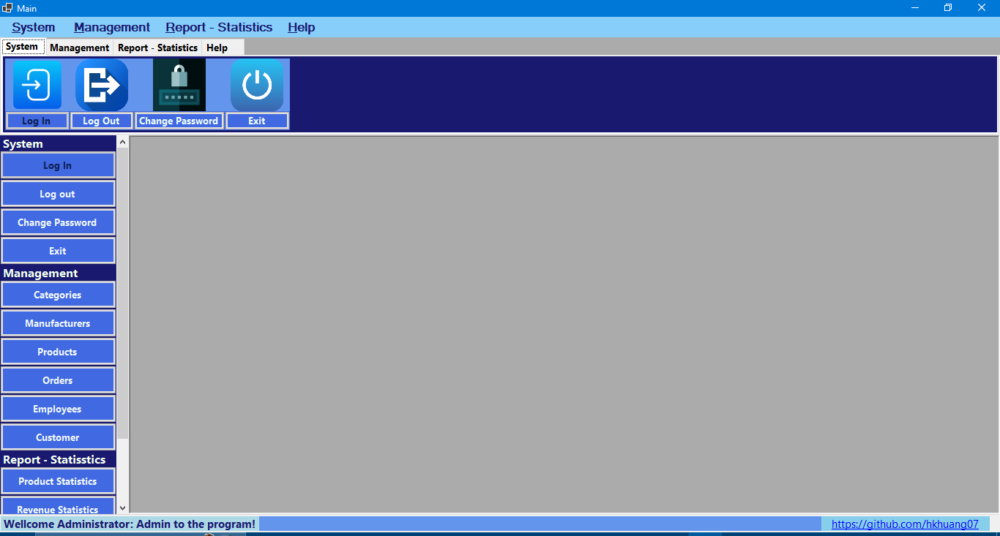
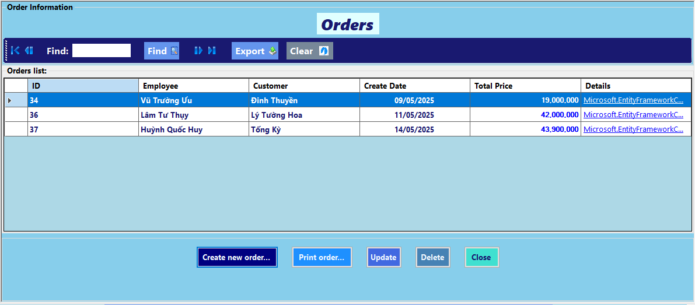

# ⚡ Sales Management System Software
## Framework: .NET 8, WinForms, ASP.NET (Entity Framework Core)
## Model: 3-Layer-Architecture

> 🚀 **Transforming retail management for the digital era!**
> Say goodbye to manual tracking and hello to a seamless, modern inventory and sales system tailored for electronic stores. Built on robust technologies like .NET 8, WinForms, and Entity Framework Core — this project sets the standard for desktop retail management solutions, engineered for future expansion into a powerful Client-Server model.

---

## 📖 Project Overview
This is a comprehensive sales management system, specifically designed for electronic stores. The project is built upon a solid 3-Layer Architecture, utilizing .NET 8 and Entity Framework Core 8, ensuring scalability, easy maintenance, and high performance. The system aims to provide a robust and efficient retail management solution, ready for future deployment as a Client-Server model.

---

## 📸 Visualization

See the application in action with these animated demonstrations:

<p align="center">
  <h3>Sales Workflow: From Search to Invoice</h3>
  
  <br>
  <em>A seamless sales process: **Search** products by name  &rarr; **Select Products** and add to orderdetails list &rarr; Click **Order** to continue &rarr; **Confirm Form** invoice printing options, and add/edit customer information &rarr; **Confirm** to Success Order &rarr; (Optional) **Invoice**.</em>
</p>

<p align="center">
  
  <br>
  <em>The main application interface – where all functionalities are intuitively connected.</em>
</p>

<p align="center">
  <h3>Authentication & Security</h3>
  
  
  <br>
  <em>Secure user login and password management.</em>
</p>

<p align="center">
  <h3>Product & Inventory Management</h3>
  
  
  
  <br>
  <em>Comprehensive management of products, categories, and manufacturers.</em>
</p>

<p align="center">
  <h3>Order & Details Management</h3>
  
  <br>
  <em>Viewing and managing order lists and their detailed items.</em>
</p>

<p align="center">
  <h3>Customer & Employee Management</h3>
  
  
  <br>
  <em>Managing customer profiles and employee accounts.</em>
</p>

<p align="center">
  <h3>Reporting & Statistics</h3>
  
  
  <br>
  <em>Visual insights into revenue trends and product performance.</em>
</p>

<p align="center">
  <h3>Information & Help Center</h3>
  
  
  <br>
  <em>Accessing software information and the comprehensive help center.</em>
</p>

---

## 🚀 Key Features

The system offers a wide range of powerful features to efficiently manage electronic store operations:

### 🔐 Authentication & Role-Based Access
The system provides secure user authentication with password hashing (`BCrypt`) and clear role-based access for `Admin` and `Employee`, ensuring each user accesses only the functionalities relevant to their role.

<p align="center">
  
  
  <br>
  <em>Login and Change Password screens.</em>
</p>

### 📦 Product Management
Detailed product information management: add, update, delete, and search for products. Displays product images and offers filtering capabilities by category or manufacturer.

<p align="center">
  
  <br>
  <em>Product management interface.</em>
</p>

### 📂 Category & Manufacturer Management
Easily manage product categories and manufacturer information, helping to organize inventory and generate reports more effectively.

<p align="center">
  
  
  <br>
  <em>Category and Manufacturer management interfaces.</em>
</p>

### 🧾 Order & Order Details Management
Manage the entire lifecycle of orders: create, update, and delete orders and their details (items, quantity, unit price). The system automatically calculates the total price and reduces stock levels after an order is confirmed.

<p align="center">
  
  <br>
  <em>The main Point of Sale (POS) interface.</em>
</p>
<p align="center">
  
  <br>
  <em>The main Point of Sale (POS) interface.</em>
</p>
<p align="center">
  
  
  <br>
  <em>Order list and order details management.</em>
</p>
<p align="center">
  
  <br>
  <em>Order printing screen.</em>
</p>

### 👥 Customer & Employee Management
Manage detailed customer profiles, including their order history. For employees, administrators can add new accounts, assign roles, and update passwords.

<p align="center">
  
  
  <br>
  <em>Customer and Employee management interfaces.</em>
</p>

### 📊 Reporting & Statistics
Generate revenue reports by date range, export invoices to PDF, and export product or order lists to Excel. View statistics on top-selling items by category/manufacturer.

<p align="center">
  
  
  <br>
  <em>Revenue and Product statistics reports.</em>
</p>

### 💾 Data Management (Backup/Restore)
Supports secure database backup and restoration, ensuring data integrity and business continuity.

### ❓ Help & Software Information
Provides detailed user guides and information about the software version, author, and licensing.

<p align="center">
  
  
  <br>
  <em>Software information and Flash screen.</em>
</p>

---

## 📚 User Guide & Help Center
For comprehensive guidance on using the Sales Management System Software, including step-by-step instructions and detailed explanations of all features, please visit our dedicated Help Center:

**[Sales Management App Help Center](https://hkhuang07.github.io/Help-Center-for-Sales-Management-App/)**

You can also access this directly from the application's help menu.

---

## 🏗️ Technology Stack

The project is built on a modern and robust technology stack, strictly adhering to the 3-Layer Architecture model:

| Layer | Technology | Description |
| :------------------------ | :------------------------------------------- | :-------------------------------------------------------------------------------------------------------------------------------------------------------------------------------------------------------------------------------------------------------------------------- |
| **Presentation (UI)** | `.NET 8 WinForms` | The user interface is built using WinForms, handling user interaction and displaying data from DTOs. |
| **Business Logic (BLL)** | `C# Services`, `AutoMapper`, `DTOs` | Contains the core business logic, data validation, and transformation between Entities and DTOs, interacting with the Repository layer. |
| **Data Access (DAL)** | `Entity Framework Core 8`, `LINQ`, `SQL Server` | Implements the Repository Pattern, using EF Core to manage all database interactions (CRUD, querying), with Code-First and Migrations support. |
| Reporting | `ReportViewerCore.WinForms`, `ClosedXML` | Powerful tools for generating dynamic reports (RDLC) and exporting data to Excel format. |
| Dependency Injection | `Microsoft.Extensions.DependencyInjection` | Helps manage dependencies between layers, increasing modularity and testability. |
| Database | `SQL Server 2022` | Relational database management system used for storing and managing data. |
| ORM | `Entity Framework Core 8` | Modern ORM framework, allowing interaction with the database using C# objects, with strong support for LINQ and features like Async, Caching, Tracking. |

### 💡 Design Highlights

* **3-Layer Architecture:** Clear separation of Presentation, Business Logic, and Data Access layers, resulting in clean, maintainable, and scalable code. This is a crucial foundation for future Client-Server deployment.
* **Entity Framework Core (Code-First with Migrations):** Utilizes EF Core 8 with a Code-First approach to define the data model via C# classes and automatically create/update the database schema through Migrations, optimized for .NET 8.
* **AutoMapper:** Helps automate mapping between Entity objects and Data Transfer Objects (DTOs), reducing boilerplate code and improving development efficiency.
* **Dependency Injection (DI):** Integrates .NET's built-in DI, managing object lifetimes and reducing tight coupling between components, supporting Unit Testing.
* **Security:** Passwords are hashed using `BCrypt.Net`, ensuring secure user information.
* **Reporting:** Employs `ReportViewerCore.WinForms` for custom reports and `ClosedXML` for exporting data to Excel.
* **Client-Server Scalability:** The 3-layer architecture combined with ASP.NET (especially EF Core) provides a robust foundation for evolving into a powerful Client-Server application, where the UI could be WinForms or a web/mobile application connecting to backend services via Web API.

---

## 📥 Getting Started

To deploy and run this project on your local machine, please follow these steps:

### 1. Prepare your development environment
* Ensure you have **Visual Studio 2022** (or newer) installed with the **".NET desktop development"** and **"ASP.NET and web development"** workloads.
* Install **SQL Server 2022** (or a compatible version) and **SQL Server Management Studio (SSMS)**.

### 2. Clone Repository
Open Git Bash or Command Prompt and clone the repository to your local machine:

```bash
git clone [https://github.com/hkhuang07/Sales-Management-Application-ASP.NET-EF-Core-In-3-Layer-Architecture.git](https://github.com/hkhuang07/Sales-Management-Application-ASP.NET-EF-Core-In-3-Layer-Architecture.git)

```
### 3. Navigate to the project directory
```Bash

cd Sales-Management-Application-ASP.NET-EF-Core-In-3-Layer-Architecture
(Or the path to the project root directory containing the .sln file)
```
### 4. Restore NuGet packages
Open Command Prompt or PowerShell in the root directory of your project (where the .sln file is located) and run the following command to download all necessary dependencies:

```Bash

dotnet restore
# Alternatively, if you are using Visual Studio, you can simply open the .sln file, and VS will automatically restore them.
```
### 5. Configure the Connection String
Open the appsettings.json file (or App.config if it's an older WinForms project) within your ElectronicsStore.Presentation and ElectronicsStore.DataAccess projects (or wherever your DbContext resides) and update the DefaultConnection string to point to your local SQL Server.
Example:

```JSON

"ConnectionStrings": {
  "DefaultConnection": "Server=localhost\\SQLEXPRESS;Database=ElectronicsStoreDb;Trusted_Connection=True;MultipleActiveResultSets=true;TrustServerCertificate=True"
}
```
Replace localhost\\SQLEXPRESS with your SQL Server instance name.

ElectronicsStoreDb is the name of the database that EF Core will create or connect to.

### 6. Initialize and Update the Database with Entity Framework Core Migrations
This project uses the Code-First approach of Entity Framework Core. You need to run Migrations to create or update the database:

Open Package Manager Console in Visual Studio (View > Other Windows > Package Manager Console).

Ensure the Default project is set to your project containing the DbContext (e.g., ElectronicsStore.DataAccess).

Execute the following commands:

```PowerShell

Add-Migration InitialCreate -OutputDir Migrations
Update-Database
```
Add-Migration InitialCreate: This command creates a new Migration named InitialCreate. If you already have Migrations, skip this command or create a new one with an appropriate name if you have structural data changes. -OutputDir Migrations specifies the directory to store the Migration files.

Update-Database: This command applies the created Migrations to your database, creating the database and tables if they don't exist, or updating existing table structures.

### 7. Run the application
Once the database has been initialized, you can run the application from Visual Studio (press F5) or from the Command Line:

```Bash

dotnet run --project ElectronicsStore.Presentation/ElectronicsStore.Presentation.csproj
```
**Important Notes:**
* If you encounter errors during `Update-Database`, please double-check your connection string in `appsettings.json` or `App.config` to ensure it is correct.
* For .NET Core WinForms projects, using a Factory Pattern (e.g., `ElectronicsStoreContextFactory`) is necessary for Entity Framework Core to create `DbContext` at design-time when running Migration commands. Ensure your `ElectronicsStoreContextFactory` is correctly implemented.

---

## 🛠️ UI Screens (Visual Modules Overview)

Here's a general overview of the application's main screens:

### Main Toolbars
Toolbars are logically organized, providing users with easy access to core functionalities.

<p align="center">
  
  <br>
  <em>System Toolbar (Login, Logout, Change Password, Backup, Restore, Exit).</em>
</p>
<p align="center">
  
  <br>
  <em>Management Toolbar (Categories, Products, Manufacturers, Customers, Employees, Orders).</em>
</p>
<p align="center">
  
  <br>
  <em>Order Management Toolbar.</em>
</p>
<p align="center">
  
  <br>
  <em>Reports Toolbar (Product Statistics, Revenue Statistics).</em>
</p>
<p align="center">
  
  <br>
  <em>Help Toolbar (Software Information, User Guide).</em>
</p>

### Side Toolboxes
Side toolboxes enable quick and efficient operations.

<p align="center">
  
  
  <br>
  <em>Control panel and quick functions.</em>
</p>

### Key Functional Forms
Each module is designed with a user-friendly interface for standard CRUD (Create, Read, Update, Delete) operations.

* **Sale Form:** The main Point of Sale (POS) interface with functions for adding to cart, removing products, and confirming orders.
* **Category/Product/Customer Forms:** Perform basic CRUD operations with data displayed intuitively in a DataGridView.
* **Order Form:** View a list of orders, filter them, and export to PDF.
* **Order Detail Form:** Add/edit product lines to a specific order.
* **Confirm Form:** Collects customer and employee information for an order.
* **Reports:** Forms for product statistics and revenue reports.
* **About Box:** Displays information about the software, version, author, and licensing.

---

## 🧱 Database Design

The project is structured with a clear database schema and logical relationships, reflecting the core entities of the sales management system.

### 📑 Entity Overview
* **Products:** `ID`, `Name`, `Price`, `Quantity`, `Description`, `Image`, `CategoryID`, `ManufacturerID`
* **Categories:** `ID`, `Name`
* **Manufacturers:** `ID`, `Name`, `Address`, `Phone`, `Email`
* **Employees:** `ID`, `FullName`, `Phone`, `Address`, `Role`, `Username`, `Password`
* **Customers:** `ID`, `Name`, `Address`, `Phone`, `Email`
* **Orders:** `ID`, `EmployeeID`, `CustomerID`, `Date`, `Note`
* **Order_Details:** `ID`, `OrderID`, `ProductID`, `Quantity`, `Price`

### 🔗 Relationships
* One **Category** &harr; Many **Products**
* One **Manufacturer** &harr; Many **Products**
* One **Employee** &harr; Many **Orders**
* One **Customer** &harr; Many **Orders**
* One **Order** &harr; Many **Order_Details**
* One **Product** &harr; Many **Order_Details**

---

## 🧠 Software Architecture

This project strictly adheres to the **3-Layer Architecture** model, a software design approach that separates application concerns into distinct layers, increasing modularity, maintainability, and scalability.

* **Presentation Layer (UI):**
    * Built using `WinForms`.
    * Responsible for the user interface and direct user interaction.
    * Displays data received from the BLL (via DTOs) and sends user requests to the BLL.
    * Contains no business logic or direct database access.

* **Business Logic Layer (BLL):**
    * Contains `C# Services` and the application's business rules.
    * Uses `AutoMapper` to map between Entity objects (from DAL) and Data Transfer Objects (DTOs) for data transfer between layers.
    * Handles validation logic, calculations, and orchestrates data flow between Presentation and Data Access.
    * Interacts with the DAL through the `Repository Pattern`.

* **Data Access Layer (DAL):**
    * Implements the `Repository Pattern` to provide an abstract interface for data access.
    * Uses `Entity Framework Core` to manage all interactions with the SQL Server database.
    * Contains `DbContext`, `Entities`, and `Migrations`.
    * Contains no business logic or user interface elements.

This 3-layer model is particularly crucial as it lays a solid foundation for future implementation as a Client-Server model. By separating business logic and data access from the user interface, we can easily replace or extend the Presentation layer (e.g., adding an ASP.NET Core WebAPI or Blazor web interface, or a Xamarin/.NET MAUI mobile application) without affecting the underlying layers.

---

## 🚧 Future Improvements

This project has significant potential for further development and expansion:

* **🌐 Build ASP.NET Core WebAPI or Blazor frontend:** Develop a robust web interface to transform the application into a comprehensive Client-Server solution, allowing access from any browser-enabled device.
* **📱 Add Xamarin/.NET MAUI mobile client:** Build mobile applications for Android/iOS, enabling remote sales management.
* **📦 Barcode/QR integration for fast checkout:** Integrate barcode/QR scanners to expedite the checkout process.
* **📤 Email confirmation for orders:** Automatically send order confirmation emails to customers.
* **🔒 Logging and audit trails:** Implement a detailed logging system for critical actions and audit tracking.
* **📈 Revenue analytics & smart product suggestions:** Enhance data analysis capabilities and intelligent product recommendations.
* **🔗 Real-time multi-user environment (Client-Server or SignalR):** Support multiple users working concurrently in a real-time environment.

---

## 👨‍💻 Developer Info

* **Author:** Huỳnh Quốc Huy
* **Student ID:** DTH225650
* **University:** An Giang University – Faculty of Information Technology
* **Mentors:** Nguyễn Hoàng Tùng
* **Date:** May 2025
* **GitHub Profile:** [https://github.com/hkhuang07](https://github.com/hkhuang07)

---

## ❤️ Final Thoughts

This project represents the culmination of a deep dive into modern desktop application development. It demonstrates a strong understanding of scalable software design, real-world database management, and clean code architecture — all while delivering a practical tool that can genuinely assist electronic store operations.

We hope this software inspires future improvements, integrations, and even full-scale product deployment in small-to-medium retail businesses.

💬 Feedback, suggestions or collaboration ideas are warmly welcome!
